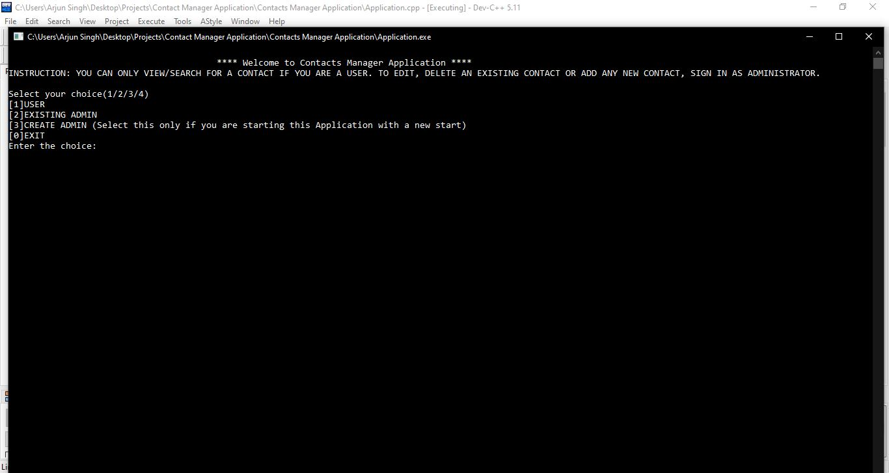
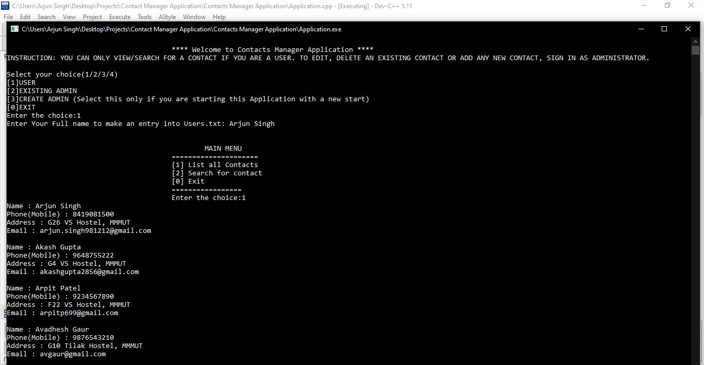
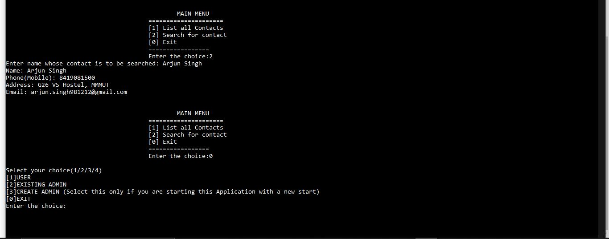
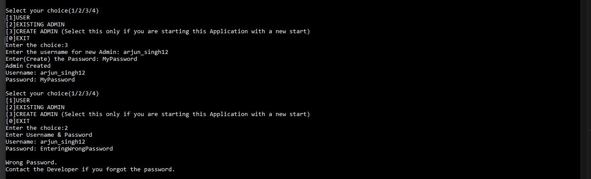
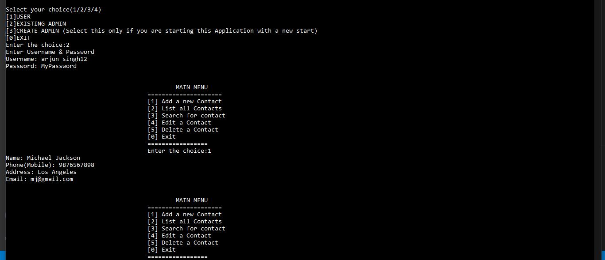
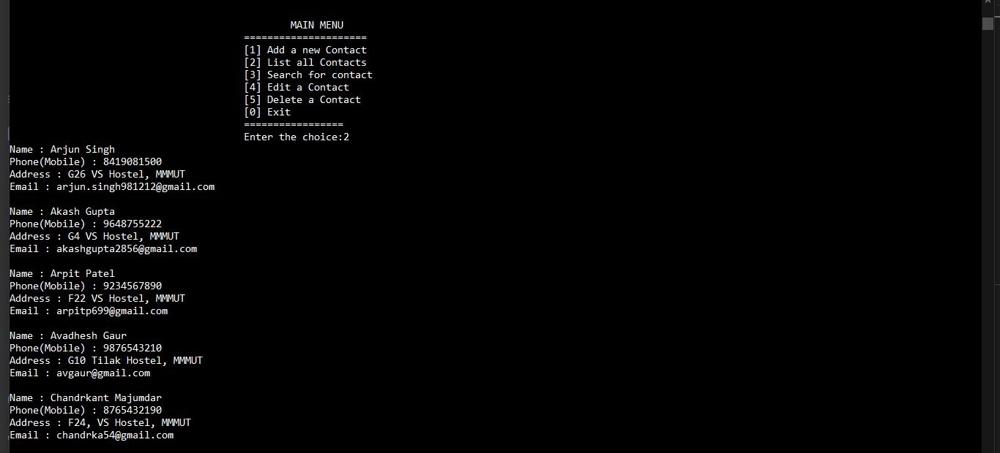
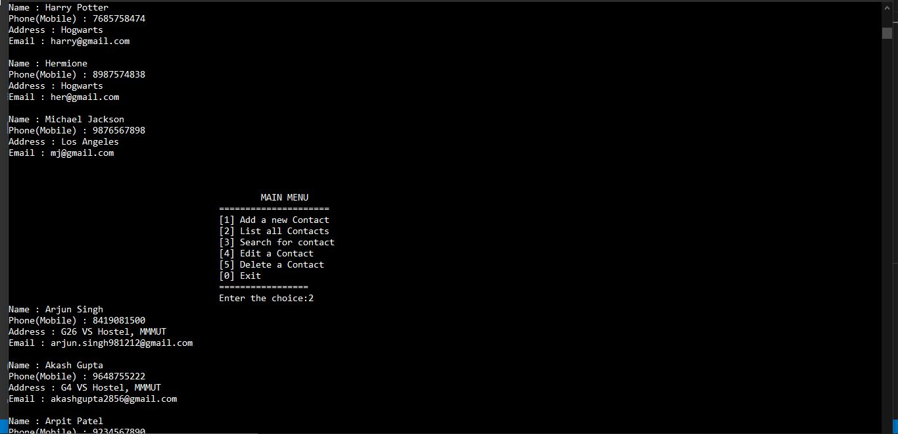
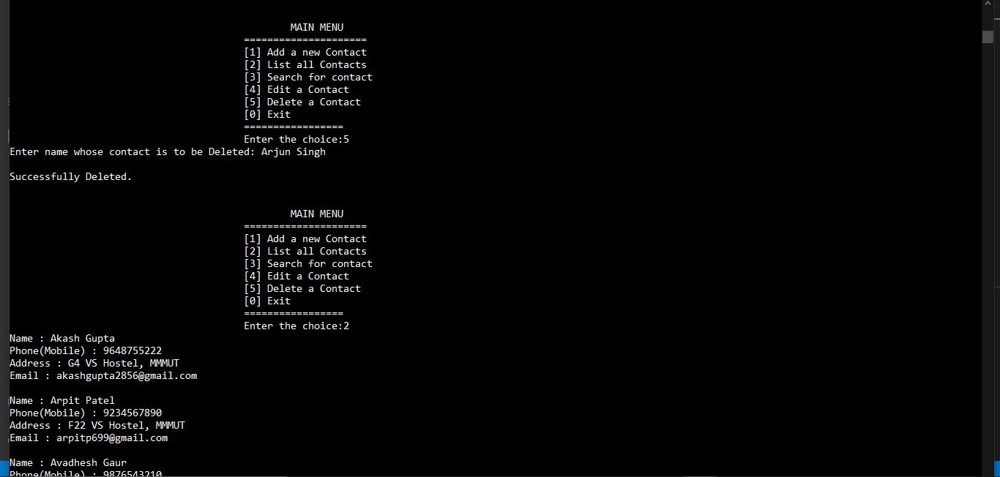
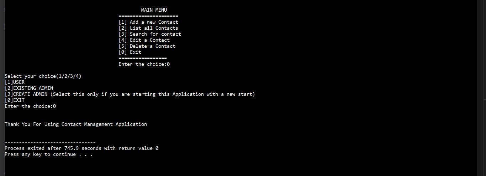

## CONTACTS MANAGER APPLICATION

> The ` Contacts Manager Application `  is the Command-Line Application program written in C++. It invovles the OOPs concepts and File Handling techniques to build the logic for the application. It was the project I was assigned to in academic C++ course in 2nd Semester.

## Content
* [Overview of the Project](#overview) 
    * [What is it all about?](#what-is-it-all-about)
* [Technical details](#technical-details) 
    * [The Concepts used in the development of the project](#Concept-stack) 
    * [How to download/clone and execute the Project on your machine](#how-to-execute-on-your-machine) 
    * [Glimpse of the project](#glimpse)

# Overview

## What is it all about?
This project is made in order to store and manage the Contact information of various connections via Command Line. It works in two modes, namely User mode and Admin mode. User mode allows you to only `List` and `Search` for the contact, while the Admin mode gives you the previlege to `Add`, `Edit` and `Delete` contacts along with the `List` and `Search` functionalities. There is also the functionality of adding new Admin. The project has been written in proper modules using the concepts of Classes and Objects, Abstraction, Encapsulation (Data Hiding), Getter and Setter methods for Password change and File Handling concepts to store the Contact Records. 

# Technical details

## Concept Stack
The technologies used to develop this web applications are 
* C++
* Object Oriented Programming Concepts
* File Handling Concepts

#### Brief Information
> C++ programming Language has been used to write the logic of the Application

> Various OOPs concepts have been applied to the project

> File Handling has been used to write/read the contact records to the file as no other specific database has been employed

## How to execute on your machine

> Follow/Understand the steps to execute/run the project on your machine.

* Download and extract the zip bundle of the project or clone the project using git cloning commands.

* Run/Execute the Application.cpp file using any of the existing IDE on your machine

## Glimpse

